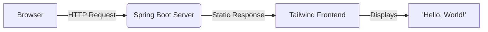

# Hello World Project

A simple client-server application featuring a **Spring Boot** backend and a **Tailwind CSS** frontend.

---

## Table of Contents
- [Overview](#overview)
- [Getting Started](#getting-started)
  - [Prerequisites](#prerequisites)
  - [Installation](#installation)
- [Running the Project](#running-the-project)
- [Project Structure](#project-structure)
- [Architecture](#architecture-diagram)
- [Screenshot](#screenshot)

---

## Overview

This project demonstrates a basic "Hello World" application setup, showcasing communication between a Java-based backend and a modern web frontend.

---

## Getting Started

### Prerequisites
Ensure you have the following installed:
| Prerequisite                      | Details                                                                  |
| :-------------------------------- | :----------------------------------------------------------------------- |
| **Java Development Kit (JDK)** | Version 17 or higher.                                                    |
| **Web Browser** | A modern browser like Chrome, Firefox, or Edge.                          |
| **Maven** | (Optional) The project includes a Maven Wrapper (`mvnw` and `mvnw.cmd`), so a separate Maven installation isn't strictly necessary. |

### Installation
To get a copy of the project up and running on your local machine, follow these steps:

-  **Clone the repository:**
    ```bash
    git clone [https://github.com/idrobodev/hello-world.git](https://github.com/idrobodev/hello-world.git)
    ```

---

## Running the Project

Once you've installed the project, you can run it as follows:

1.  **Ensure you are in the `backend` directory:**
    ```bash
    cd hello-world
    ```
2.  **Execute the Spring Boot application:**
    * **For Windows:**
        ```bash
        mvnw.cmd spring-boot:run
        ```
    * **For Linux/macOS:**
        ```bash
        ./mvnw spring-boot:run
        ```
3.  **Access the application:**
    Open your web browser and navigate to `http://localhost:8080`.

---

## Project Structure

The project is organized into `backend` and `frontend` directories:

```
hello-world/
│   ├── src/                 # Código fuente de la aplicación
│   │   └── main/            # Contenido principal de la aplicación
│   │       ├── java/com/example/helloworld/ # Paquete base de la aplicación Java
│   │       │   ├── HelloWorldApplication.java   # Clase principal de la aplicación Spring Boot
│   │       │   └── controller/        # Clases controladoras
│   │       │       └── HelloController.java    # Controlador REST para "Hello World"
│   │       └── resources/       # Recursos de la aplicación
│   │           └── static/      # Archivos estáticos (frontend)
│   │           │   ├── index.html     # Página HTML principal
│   │           │   ├── app.js         # Lógica JavaScript del frontend
│   │           │   └── styles.css     # Estilos CSS del frontend
│   │           └── templates/   # Plantillas 
│   │           │   └── application.properties # Propiedades de configuración de la aplicación
│   │           └── assets/      # Recursos adicionales
│   │           │   ├── screenshot.png # Captura de pantalla de la aplicación
│   ├── mvnw                 # Script wrapper de Maven (para Unix/Linux)
│   ├── mvnw.cmd             # Script wrapper de Maven (para Windows)
│   └── pom.xml              # Archivo de configuración del proyecto Maven
│   └── README.md            # Archivo de documentación del proyecto
```

---

## Architecture Diagram


## Screenshot
